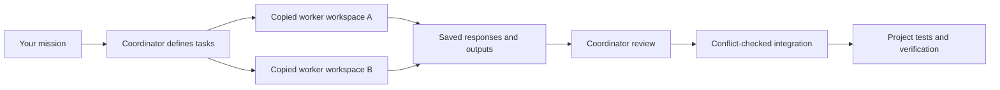

# Project Swarm

**Give one coordinator a mission. Let scoped workers handle independent pieces. Review and integrate the results.**

Project Swarm is a reusable agent skill and dependency-free Node.js runner for coordinating fresh Claude Code, Hermes, and Qwen Code workers plus tool-free OpenAI, Gemini, Ollama, Lambda, and OpenRouter API jobs inside a project. It grew out of a real website build: Claude implemented commerce pages, then a reusable worker pool helped review rendering and scroll animation.

It is designed for a human or coding agent acting as the coordinator. The coordinator decides the tasks, supplies context, reviews findings, integrates changes, and verifies the final product.

Codex CLI workers (`codex`) run in per-job git worktrees under a macOS seatbelt sandbox with an explicit model; see [provider setup](docs/providers.md). **The Codex sandbox is macOS-only** (it uses `sandbox-exec`): on Linux, WSL or Windows, `doctor codex` reports unsupported and `run` refuses codex jobs.

## Agent kickoff

The orchestrator can be **any agent**: Claude Code, Codex CLI, Cursor, Gemini CLI,
or another agent with file and command access. The worker adapter does not
need to match the orchestrator. Paste this into your agent at project start:

```text
Use Project Swarm 1.48.0 for this project. Read docs/kickoff.md in the toolkit
and perform its kickoff workflow. Ask me up front which model providers may
receive project code and what spend ceiling applies; wait before model calls.
Install from tag v1.48.0 in ~/.project-swarm, run tools/install.mjs --user,
link this project, run doctor, validate and run the read-only and writing smoke
jobs, inspect and integrate the reviewed writing output. Read the installed
SKILL.md and coordination/ORCHESTRATOR.md. Fill TASK.md from my goal, maintain
HANDOFF.md after every dispatch, and start authorized work. Hand off at the
10th build dispatch or before unrelated work, whichever comes first. Never run update/version with --root, commit .swarm/,
or let a worker see secrets.
```

The [complete kickoff prompt](docs/kickoff.md) includes exact commands,
one-line skill loading for each agent, provider consent, exclusions, and the
handoff prompt. For every agent the direct loading line is:
`Read ~/.project-swarm/current/skills/project-swarm/SKILL.md and coordination/ORCHESTRATOR.md.`
Cursor also discovers `.cursor/rules/project-swarm.mdc`; other agents can
follow the linked project's AGENTS.md or CLAUDE.md pointer.
See the [anonymized field report](docs/field-report.md) for evidence and limits.
The [lessons file](docs/lessons.md) is the loop: every real-run friction becomes an entry plus, where possible, a tool check and a test.

`swarm ticket MANIFEST --pr PAYLOAD` runs the guarded pipeline through ship, stops at the first red stage, and resumes with `--resume RUN`. Use `swarm scaffold job` to generate validated job manifests (`scaffold job --command <swarm command>` adds handler modules resolved from CLI dispatch to context) and `swarm scaffold pr` for PR payloads with an explicit mutation stub that must be replaced with evidence before shipping a required mutation section.

`swarm lesson add` captures clock-stamped, private-safe evidence and routes its rule into an existing worker skill or gotchas; tool lessons stay queued. Use `lesson list` and `lesson set` to track the queue, `lesson manifest` to declare a bounded fix with a regression test, and `lesson check` to audit stale lessons and installed test files. `lesson publish --version V` appends safe shipped entries to the public archive, while `lesson import [--from FILE] [--dry-run] [--verbose]` converts legacy rows idempotently or previews counts and per-row verdicts without writing.

Release 1.16.0 adds post-build mutants (`integrate --mutants --mutants-file`
and a job-declared `mutantsFile` output), an `agentError`/`agent.log` capture
so a crashed or blocked worker's own reason survives past a generic "missing
output", and a `validate` warning when a job's context omits new files added
to the same directory since an earlier round; see the
[command reference](docs/manifest-reference.md) and
[lessons 18–20](docs/lessons.md).

Release 1.17.0 adds a standalone `mutants --mutants-file F --mutant-check
ARGVJSON` command that mutation-tests the current tree with no run id,
`validate`/`run` support for `--evidence <file>` (appended verbatim to every
job prompt), a `resultMissing` flag plus a cheap JSON re-ask when a job's
final message doesn't parse, a `contextGlob` filename-prefix form, a `doctor`
warning for tool paths resolving under `/tmp`, a `validate` warning when a
job's own core module is an untestable output, `inspect` cost-per-1k-token
reporting, and a `run` warning when a no-shell worker is handed a runtime
check failure it cannot reproduce. `ship` now resolves `gh`/`git` up front and
always includes stderr (or `(empty)`) in a `pr list failed` reason, and
`scout`/`sweep --brief` accepts any readable path, including one outside the
project root, copied in for provenance. See
[the command reference](docs/manifest-reference.md) and
[lessons 21–31](docs/lessons.md).

Release 1.18.0 makes `integrate --mutants` parse and validate every mutants
source before writing any project file (a bad shape now refuses with nothing
written, and a later failure leaves a run marked `integrationStatus:
"partial"` that can still be retried), skips mutants with `skipped-red-base`
whenever any check failed instead of reporting a meaningless killed/survived
verdict (`ship --require-section "Mutation check"` refuses one of those
outright), flags a `.json` output that fails to parse at job completion
(`output-invalid-json: <path>`), warns when a job's mutants-shaped output
never declares `mutantsFile`, and warns when a job's `contextGlob` entries
for one directory cover only some of its filename prefixes. See
[the command reference](docs/manifest-reference.md) and
[lessons 32–36](docs/lessons.md).

Release 1.19.0 adds claude shell jobs (`shell: true`, or model `sonnet-shell`/`opus-shell`): the whole `claude -p` process runs under a generated macOS seatbelt profile with a sandboxed Bash, writes only in its worktree, network only to the model API, so the worker can run the checks itself; see [shell jobs](docs/manifest-reference.md#shell-jobs) and [lesson 40](docs/lessons.md).

## Shared install

```sh
git clone --branch v1.37.0 --depth 1 https://github.com/RDW-Labz/project-swarm.git ~/.project-swarm
node ~/.project-swarm/tools/install.mjs --user
node ~/.project-swarm/tools/install.mjs /absolute/path/to/project
node ~/.project-swarm/current/tools/swarm.mjs --root /absolute/path/to/project doctor all
```

For an existing install, preserve local edits and run the install's `version
--check`, then `update` when authorized, both without `--root`. No npm install
is needed. Linking writes idempotent agent pointers, adds `.swarm/` to
`.gitignore`, and seeds each missing coordination file; existing files are
reported as kept. Use `--no-agent-files` to opt out of project agent pointers.

## Start here

You need **Node.js 20.3+**, macOS/Linux/WSL, and one configured provider. For Claude jobs, use an installed, authenticated **Claude Code CLI** supporting the restricted-mode flags. API jobs use environment credentials (or a local Ollama server), with no Claude installation required. Native Windows process cleanup is not supported.

Clone the public repository. No GitHub account or access invitation is required:

```sh
git clone --branch v1.37.0 --depth 1 https://github.com/RDW-Labz/project-swarm.git
cd project-swarm
npm test
npm run check
node tools/swarm.mjs doctor all
```

There are no npm dependencies to install. Tests use fake local workers and mock HTTP responses; they make no model calls. `doctor all` reports local compatibility/configuration without a model call; Codex also checks local login status. Start with the Claude smoke below, or choose an API smoke from [provider setup](docs/providers.md):

```sh
node tools/swarm.mjs preflight examples/smoke.json
node tools/swarm.mjs run examples/smoke.json
```

The run prints an ID. Inspect the responses in `.swarm/runs/<run-id>/`, then inspect proposed files before importing them:

```sh
node tools/swarm.mjs status <run-id>
node tools/swarm.mjs inspect <run-id>
# Read each response.txt and the proposed file in its copied workspace.
node tools/swarm.mjs integrate <run-id>
```

A successful smoke run produces `coordination/swarm-handshake.md` after integration. Each live worker uses your own provider access and can consume billable usage. A host environment may require network execution approval.

Codex and Claude shell jobs use detached worktrees outside the project root by default, under the configured scratch directory, so repository tooling does not walk worker copies. Set `worktreesOutsideRoot: false` in the local config to retain the in-root layout. The saved `worktreePath` remains authoritative for inspection and integration, while runs without that field keep the historical in-root fallback.

## Drop it into another project

Project Swarm uses one shared install per machine (conventionally `~/.project-swarm`; invoke your chosen install path explicitly); projects no longer get their own copy of the runner, tests, or skill. Link a project to that install:

```sh
node ~/.project-swarm/tools/install.mjs /absolute/path/to/your-project
```

This writes a small pointer file, `.project-swarm.json`, recording the install root and its version, and registers the project so `swarm update --projects` can find it later. It seeds each missing `coordination/` manifest and the generic ORCHESTRATOR.md, HANDOFF.md, TASK.md and swarm-lessons.md templates, reporting added and kept files. Existing coordination files are never overwritten. It updates marker-delimited AGENTS.md and CLAUDE.md blocks plus `.cursor/rules/project-swarm.mdc` unless `--no-agent-files` is given. It does not copy `tools/`, `tests/`, or `skills/` into the project, and does not change package scripts, global settings, credentials, or the target's Git remote.

Link adds `.swarm/` to `.gitignore`. Add `.swarm-old-copy-*/` too if migrating old copies, and configure the [tool exclusions](docs/kickoff.md#keep-copied-source-out-of-project-tooling). Then, in that project:

```sh
node ~/.project-swarm/tools/swarm.mjs --root . doctor
node ~/.project-swarm/tools/swarm.mjs --root . preflight coordination/swarm-smoke.json
node ~/.project-swarm/tools/swarm.mjs --root . run coordination/swarm-smoke.json
```

`--root` is refused by update/version before git access. For project commands it selects one explicit project; manifest filenames and all context/output paths resolve inside it, regardless of your shell's working directory. If a project's `.project-swarm.json` version no longer matches the installed version, `run`/`validate` print one warning to stderr — they still run; use `swarm update` in the install root to realign.

## Updating

`swarm update` moves the shared install itself to the newest release tag; it refuses if you have uncommitted changes in its own `tools/` or `skills/`, and prints `{from, to, changelog}` (or `{from, to, upToDate: true}` if already current). Run `swarm version --check` to see whether a newer tag exists without changing anything. Nothing updates itself: the skill checks once per session and only asks — it runs `update` after the user says yes, never on its own.

Installs are versioned: each install/update snapshots the runtime into its own directory and atomically repoints a `current` symlink at it, so `<source>/current/tools/swarm.mjs` is always the runner path and a run already in flight keeps using its own version even if `update` replaces files underneath it mid-run.

Old per-project copies from before this shared-install model can be found and replaced with a pointer using `swarm update --projects`. Without `--yes` it only reports what it found; with `--yes` it writes the pointer and moves only the files the old installer copied in (the swarm's own `tools/*.mjs`, `tests/*.test.mjs`, `skills/project-swarm/` and `licenses/project-swarm/`; the project's own tools and tests stay) into a timestamped `.swarm-old-copy-*/` folder in that project rather than deleting them. It never touches `coordination/` or `.swarm/`.

## Ask your coding agent to coordinate

After installation, give the coordinator a prompt like:

> Read `skills/project-swarm/SKILL.md`. Use Project Swarm to improve this feature. Split independent work into focused assignments, give each output one writer, review the workers' responses, integrate appropriate changes, and run the project's checks. Keep all work inside this repository.

`node ~/.project-swarm/tools/install.mjs --user` installs the skill into every agent home whose parent directory exists (`~/.claude/skills/project-swarm/`, `~/.codex/skills/project-swarm/`), so a supporting agent can discover it automatically; otherwise read `skills/project-swarm/SKILL.md` explicitly. See [setup](docs/setup.md) for setup and sharing details.

## Ship smaller pieces

Before dispatch, give every job one coherent deliverable, one owner for each output, and an observable acceptance check. Split a job when it crosses unrelated concerns or has distinct checks that can run independently. Agree on shared interfaces first; run dependent implementation in later batches after reviewed integration. More workers help only when they have independent work.

Use `preflight` to expose context size and snapshot hazards. Group jobs into small batches that can be reviewed and integrated together: one slow job otherwise holds every output in its run. Review completed outputs while peers finish, then run focused tests plus the project integration checks. A manager may propose a plan or review one area, but the coordinator still validates and dispatches workers.

The [connector and village study](docs/connector-swarm-study.md) records observed wait time, changes, and limits. It does not claim a measured speedup without a controlled comparison.

The [mission readiness follow-up](docs/automation-integration-study.md) shows why an automatic workflow needs an eligible worker as well as a ready manager, tests using its bundled prompts, and real provider proof before claiming activation readiness. It records executed checks and distinguishes preparation, activation, execution, and business outcomes.

## What happens during a run



- Each worker gets explicitly listed files and declared output ownership.
- Concurrency defaults to 2 and accepts an explicit 1–32, shared across CLI processes and API requests. They do not attach to existing terminal sessions.
- Claude reading jobs have Read/Glob/Grep; writing jobs also have Write/Edit. API jobs receive only copied UTF-8 text and return validated file contents; they have no tools. Shell, agent, browser integration, and MCP tools are disabled by the adapter.
- Integration imports only declared files, rejects missing output/deletions, checks content and permission conflicts, and preserves existing executable bits.
- Prompts, responses, provider logs, resolved model identifiers, usage, and reported cost remain in the local run directory.
- The coordinator handles follow-up rounds by explicitly passing earlier responses into a new assignment. Workers do not maintain a shared conversation or coordinate themselves.

Copied workspaces and guarded integration are **not an operating-system security sandbox**. Read [the scope and threat model](SECURITY.md) before using sensitive source. Keep secrets out of worker context.

## A real assignment

```json
{
  "version": 1,
  "concurrency": 2,
  "jobs": [{
    "id": "render-review",
    "agent": "claude",
    "model": "sonnet",
    "prompt": "Review this renderer for concrete performance problems. Write evidence-based findings; do not edit the source.",
    "context": ["src/renderer.js"],
    "outputs": ["coordination/render-review.md"],
    "timeoutMs": 180000
  }]
}
```

Replace paths with files that exist in your project. An empty `outputs` array makes a reading-only job. Every job, CLI or API, requires an explicit `model`; the runner never falls back to a CLI default. Model aliases resolve through your provider and may change; run records capture the actual model identifier when returned.

## Commands

| Command | Purpose |
| --- | --- |
| `doctor [all] [--probe-local]` | Configuration, compatibility, optional local health, tool exclusions |
| `validate` / `preflight` | Validate scope and review context before dispatch |
| `run` / `ask` | Execute a manifest or one read-only question |
| `note` | Append a clock-stamped note to `TASK.md` or `HANDOFF.md` |
| `status` / `monitor` / `wait` | Inspect progress or wait for completion |
| `inspect` / `integrate` | Review proposals, then import and check them |
| `cancel` | Stop the runner's owned workers |
| `board` | Inspect live runs and file ownership |
| `scout` | Research prior art for one goal |
| `sweep` | Research several areas with a dispatch cost threshold |
| `check-pins` | Find stale internal version pins against what a project actually vendors |
| `ship` | Push reviewed work, create/update its PR, wait for CI, merge when authorized |
| `clean-branch --from REF [--exclude GLOB]...` | Stage source changes on the current clean branch, preserving renames and deletions |
| `go` | Chain run, integration, optional commit and ship |
| `ticket MANIFEST --pr PAYLOAD` | Run, inspect, integrate, check, commit bounded files, and ship; resume with `--resume RUN` |
| `scaffold job` / `scaffold pr` | Generate validated job manifests or PR payloads with explicit mutation stubs |
| `version` / `update` | Inspect or upgrade the shared install; never use `--root` |
| `onboard` | Explain workflow and local provider configuration |

`clean-branch --from wip --exclude docs/_swarm` copies committed source changes onto the current clean branch and stages them for review. It uses `git diff --name-status -M` and a binary patch to preserve renames, deletions and file modes; exclusions accept Git pathspec globs and can be repeated. Create and check out the destination branch first, then review and commit the staged diff. `ship --branch` refuses `branch-not-ahead` before running checks when the branch has no commits over its base.

Integration reports the parsed keys, source and a bounded text excerpt for skill result-shape failures. When every declared output exists, the shape failure becomes a warning; `integrate RUN --accept-result-shape` explicitly accepts other result-key mismatches. File-change requirements and integration conflicts still apply. The debugging skill attaches automatically only when the prompt requests a fix; `skills: ["debugging"]` explicitly opts in from the manifest.

- `doctor [claude|codex|hermes|qwen|openai|gemini|ollama|lambda|openrouter|all] [--probe-local]` — check compatibility/configuration and root tool exclusions; no network by default. `--probe-local` checks only loopback HTTP health with a short timeout and no credentials; cloud keys remain configuration-only. Omitted provider means Claude.
- `validate <manifest>` — check schema, paths, files, and size limits; no run or model call. Warnings include `command-handler-not-in-job` for a named command whose handler is absent from context and outputs, and `max-output-below-model-default` for an explicit API/OpenRouter token cap below its model default (16000 for reasoning models), naming both values. Single-request API outputs default to 61440 bytes total and 15360 per existing file; override job `outputCapBytes` or config `outputCap`, otherwise `output-cap-exceeded` directs oversized work to codex or smaller outputs; shell agents are exempt. A refusal for an uncovered test names exactly which tests to add via `suggestedIgnoreTests: {"<jobId>": ["tests/...", ...]}` in its JSON, ready to paste into `ignoreTests`.
- `preflight <manifest>` — validate and flag oversized jobs, repeated context, and snapshot dependencies before dispatch. Warnings support coordinator judgment; they do not automatically split or launch jobs.
- `run <manifest>` — start workers and save the exchange. Refuses to start if another live run in the same repository (any of its worktrees) is already writing one of this run's declared outputs, with no override; see `board` below. A job may declare `after: [ids]` so it starts only once those jobs complete; see [the manifest reference](docs/manifest-reference.md#after). When the manifest sets `contract`, a `codex` job's prompt also gets that file's current text injected directly, ahead of the task itself.
- `ask [--tier cheap|mid|expensive] [--model M [--agent A]] --context f1,f2,... [--timeout S] "question"` — build and run one read-only job in memory, wait for it, and print `{"id","status","model","actualModel","modelMismatch","costUsd","contextFiles","warnings","result"}`. A tier selects `config.tiers.<tier>.agent` and `.model`; `--tier` is mutually exclusive with explicit `--model` or `--agent`, while legacy `--model` routing remains unchanged. A selected unsupported ask agent (`codex`, `hermes`, or `qwen`) uses only its configured `tiers.<tier>.fallback` object and adds `route: {tier, requestedAgent, requestedModel, agent, model}` plus `ask-agent-fallback: <fromAgent>/<fromModel> -> <agent>/<model> (tier <tier>); using configured read-only fallback` to every answer branch. Native Codex read-only remains unsupported. Refusals are `ask-route-invalid: choose either --tier cheap|mid|expensive or --model with an optional supported --agent; configured routes require agent and model` and `ask-agent-fallback-unconfigured: no unique supported fallback for <fromAgent>/<fromModel>; select --tier and configure tiers.<tier>.fallback with agent and model`. See [the manifest reference](docs/manifest-reference.md#ask).
- `note [--file RELATIVE_PATH] "text"` — append `- <timestamp> <text>` to `TASK.md` by default, or to a repository-relative `TASK.md`/`HANDOFF.md` path. The timestamp is generated by the command; text is literal, single-line data and is never executed.
- `status <run-id>` — read progress, errors, and model metadata.
- `monitor <run-id>` — concise snapshot of queued/running/completed jobs, observed peak concurrency, timings, numeric usage, and content-free CLI output counters. Silence is not proof that a worker is stuck. Add `--view` for a human-readable table instead of JSON, and `--watch [seconds]` to keep it redrawing in place (read-only) until the run finishes:

  ```sh
  node tools/swarm.mjs monitor <run-id> --view --watch 5
  # Run a1b2c3-9f8e — running
  # 1 running · 2 done · 0 failed · 1 queued  ·  elapsed 38s  ·  peak concurrency 2
  #
  # JOB             AGENT   MODEL   TIER  STATUS     TIME  OUT
  # render-review   claude  sonnet  mid   + done      12s    1
  # scroll-anim     claude  -       -     > running    9s    1
  ```
- `inspect <run-id>` — inspect proposed outputs and conflicts without importing; carries a top-level `warnings` array noting any job whose reported model didn't match what was requested. Add `--results` to print just `{"runId","status","warnings":[...],"jobs":[{"id","status","model","actualModel","modelMismatch","costUsd","result"}]}` and nothing else. `wait` and both forms of `inspect` also report each job's `tokens` (`usage.total_tokens`, or `null`) plus run-level `tokens` (their sum, or `null`) and `costNotReported` (ids of jobs with no reported `costUsd`).
- `integrate <run-id> [--jobs <id,...>] [--accept-blocked]` — import reviewed, declared outputs from a successful run (or only named complete jobs from a partial run; `--jobs=a,b` is also accepted before or after the run id), then run the manifest's optional `checks` (format, tests) right after writing files; add `--no-checks` to skip them or `--require-checks` to fail the command when a check fails. `--accept-blocked` excludes a blocked job's unwritten outputs (its written ones still integrate) and `--jobs` excludes unnamed jobs from missing-output and undeclared-delete checks; a blocked job with no writes contributes no files or refusals. Job worktrees stay under `.swarm/runs/<id>/worktrees/`; `integrate` and `ship` strip check-output lines whose paths start with `.swarm/` from pass/fail decisions, reporting one `check-hit-swarm-dir` warning with the count, and `run` warns `swarm-dir-not-ignored` once when the root eslint/vitest/pytest config never names `.swarm`. A `checks`/`mutantCheck` argv item may contain `{root}` anywhere inside it, expanding to the run's absolute project root, so parallel runs never share a build/output folder. A check may set `repeat` (1–20) to rerun its argv until the first failure, and `{new}`/`{new:.ext}` expand to files that did not exist before the run started. See [the manifest reference](docs/manifest-reference.md#repeat).
- `cancel <run-id>` — request shutdown of that runner's owned workers.
- `board` — print a read-only snapshot, `{"runs": [...]}`, of every live run this machine's user is tracking across every worktree of every repository, pruning any whose process is no longer alive. This is also what `run` consults to refuse a second writer. See [the manifest reference](docs/manifest-reference.md#board).
- `ship <run-id> --repo OWNER/NAME --pr payload.json` — for an already-integrated run: push its branch, open or update the pull request, re-run the manifest's `checks` and fill them into the PR body, wait for CI, and merge once green. Refuses on a dirty tree, a failed check, a missing required `--require-section`, or a rejected push; never merges a PR body that opens with a `**needs ` human-review marker. Resolves `gh`/`git` up front and refuses at once with a plain "not found on PATH" (or the spawn error text) when either is missing; a `pr list failed` reason always names stderr, or `(empty)`. Add `--no-merge` to stop at a green `ready` state, `--merge-method squash|merge|rebase` (default `squash`), or `--timeout`/`--poll` (seconds) to tune CI waiting. A repeatable `--exempt <guard>:<file>=<reason>` excuses one file from one test-file diff guard (`undocumented-binary` or `env-var`), logs and lists the used exemption in the PR body's `## Exemptions` section. Against a repo `gh` reports public, `ship` also refuses before pushing when the diff adds a line matching a private-names list (`coordination/private-names.txt` in the project root, or `--private-names FILE`; one term per line, `#` comments ignored, case-insensitive substring match against only the lines the diff adds), naming each hit's file, line and matched term without ever echoing the line itself. `ship --help` (and `-h`) prints usage and exits 0 in any argument position. `ship --preflight` flags `git-ignored-fixture` only when a referenced path exists and is git-ignored; absent runtime paths are not flagged, and `--exempt git-ignored-fixture:<file>=<reason>` remains available. See [the manifest reference](docs/manifest-reference.md#ship).
- `go <manifest.json|run-id> [--commit-message MSG] [--repo OWNER/NAME --pr payload.json] [--require-section NAME]... [--mutants] [--merge-method M] [--timeout S]` — one command from a manifest (or an already-started run) to a merged, reviewed change: run and wait (skipped for a run id), integrate with checks, commit exactly that run's integrated files (never `git add -A`) when `--commit-message` is given, then ship when `--repo`/`--pr` are given. Prints one JSON line and exits `0` for `merged`/`held`/`ready`/`integrated`/`committed`, `1` for `failed`. See [the manifest reference](docs/manifest-reference.md#go).
- `scout --model M --brief FILE "goal"` — prior-art research for one large task; `--brief` may be any readable path, including outside the project root; validates license claims and writes a report for review.
- `sweep --model M --brief FILE --goals FILE [--max-usd N]` — prior-art research across several areas with a dispatch spending threshold; review findings before adoption.
- `check-pins [--root DIR] [--json] [--core NAME] [--app-prefix PREFIX]` — reads what a project actually ships (its dependency manifest, lockfile, and vendored copies) and reports a stale internal pin: a library that exact-pins the shared core package named by `--core` instead of a range (a repo whose own name starts with `--app-prefix` is exempt), an exact pin that no longer matches a vendored copy, a pin older than a newer vendored copy, or (in an application vendoring `--core`) a vendored core wheel's runtime requirement absent from both vendored wheels and direct project dependencies. Without `--core`, the three core-specific rules are skipped in `skippedRules` in their established order: `library-exact-core-pin`, `wheel-requirement-unsatisfied`, `vendored-core-missing-runtime-wheels`. Prints one finding per line (or one JSON object with `--json`) and exits `1` when any finding is present, `0` otherwise.
- `version [--check]` — print `{version, installRoot, tag}`; with `--check`, also `latest`/`updateAvailable` from the `origin` remote's tags (or `checkError` if the remote can't be reached). No local files change.
- `update [--projects [DIR...]] [--yes]` — move this shared install to the newest release tag and reinstall the skill; or, with `--projects`, find old per-project copies/stale pointers and replace them with a pointer only when `--yes` is given.
- `onboard` — print a plain-language summary of what the swarm does, provider compatibility and configuration on this machine, and how to ask for work; generated from local `doctor` checks, no model call.
- `--root <project>` — explicitly choose the project, before or after a project command; refused for `update` and `version`.

## Learn, modify, and share

- [Active orchestration and monitoring](docs/orchestration.md)
- [Manager task contracts and staged delivery](docs/managed-feature-plan.md)
- [Providers, authentication, and API smoke tests](docs/providers.md)
- [Setup and troubleshooting](docs/setup.md)
- [Workflow recipes and coordinator prompts](docs/workflows.md)
- [Manifest and command reference](docs/manifest-reference.md)
- [Worker skills](docs/worker-skills.md)
- [Modifying the runner and adding providers](docs/extending.md)
- [Automation handoff integration study](docs/automation-integration-study.md)
- [Real-world website case study](docs/case-study.md)
- [Contribution guide](CONTRIBUTING.md)
- [Security and limitations](SECURITY.md)
- [Changelog](CHANGELOG.md)

Nine adapters are implemented: `codex` (macOS-sandboxed Codex CLI), `claude`, `hermes` (Nous Research CLI), `qwen` (Qwen Code CLI), `openai` (Responses API), `gemini` (generateContent), `ollama` (chat API), `lambda` (OpenAI-compatible chat completions against hosted Lambda Inference or an operator-owned origin), and `openrouter` (OpenRouter chat completions; every request denies provider data collection, `anthropic/*` models are pinned to Anthropic, `deepseek/*` models may write bookkeeping files only, and spend is capped at $5 per job and $25 per UTC day). API workers are single-request text/file generators, not interactive coding CLIs. Their contract is tested with mock HTTP responses; this release does not claim live API account/model verification. Claude has a recorded live project-scoped history. See [provider setup](docs/providers.md) for honest capability limits and smoke verification.

Use the included recipes for code review, UI source review, documentation, test planning, four-worker Claude reviews, and mixed-provider reviews. API workers do not see rendered screenshots or run tests. The coordinator performs those checks. Hermes and Qwen use serialized copied context and strict JSON file envelopes; they do not get file-editing tools through this adapter. Their compatibility and authentication must be checked independently. Raising concurrency is opt-in and increases simultaneous resource use; it is not a spending cap.

The repository is public. Anyone can clone it, download a release archive, or fork it. Cloning does not require a GitHub account; creating a fork does. `RDW-Labz` in the clone URL identifies the repository owner, not an account you need to sign into. Each person uses their own provider authentication for live workers. The code and documentation are licensed under [Apache 2.0](LICENSE); preserve the license and applicable notices when redistributing. This package includes no example website assets, customer data, credentials, or private agent transcripts.
